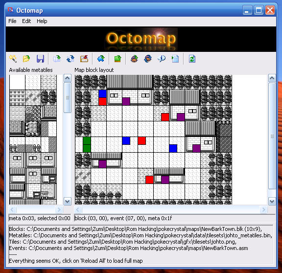

# Octomap

This is another Gold/Silver/Crystal disassembly map editor very much inspired by [PolishedMap](https://github.com/Rangi42/polished-map). This was developed more for nostalgic reasons than anything, really &mdash; trying to get a feel for the old style of tools while working with the new stuff. I really wanted to combine what I know now with the feeling of working on this niche for the first time. ~~Also, I couldn't compile PolishedMap :p~~

It also just so happens to double as a &ldquo;&ldquo;functioning&rdquo;&rdquo; map editor.

## Features

* Unified map and event editing
* Configurable text editor support (supports Sublime Text, [XTE](https://github.com/ZoomTen/XTE) [use Sublime syntax], Notepad++, VSCode [attempted])
* Load/save map, event and metatile load paths
* Load path guessing (that doesn't assume Makefiles... idk)
* Built-in help... kinda.
* Easily runs on most systems...? I guess?
* Supports both old-style and new-style syntax (`db *` vs `def_*_events`)
* Supports commenting and uncommenting events from the map editor (here, referred to as &ldquo;toggling visibility&rdquo;)
* *Some* amount of UI customization through Preferences

## Icons

*  - **open** map layout (.blk)
*  - **open** map metatiles (.bin)
*  - **open** tilesets (.png)
*  - **open** map event data (.asm)
*  - **open** filepath settings (.ini)

----

*  - **refresh** map layout
*  - **refresh** map event data

----

*  - **save** map as another file
*  - **save** filepath settings (.ini)

----

*  - try to **guess** files from project
*  - **view** resulting event code
*  - **view** entire event file

## Requirements

* Python 3.4.x (<= 3.4.4)
* Pillow (PIL)
* Some text editor

## Using it on Windows XP

* Ensure you've got a browser that works with the latest HTTPS sites. I recommend the latest compatible version available of the big browsers, or MyPal.
* Get Python 3.4.4 (last known XP-compatible version): https://www.python.org/ftp/python/3.4.4/python-3.4.4.msi
* Get Pillow 3.4.0 for Windows (picked at random, somehow works): https://files.pythonhosted.org/packages/35/b9/92a32a70a97126aa8fecdd7c1be4e0fbb9b77fc5ecddaa00ab39922dc73c/Pillow-3.4.0.win32-py3.4.exe
* Install Python as usual.
* Install Pillow from the .exe (might be more reliable than using pip)
* Type in this URL: https://github.com/ZoomTen/Octomap/archive/refs/heads/master.zip, extract the folder within, somewhere easy to find on your file system.
* Double-click on octomap.py.
* If you wish, you can create a shortcut to it on desktop.
